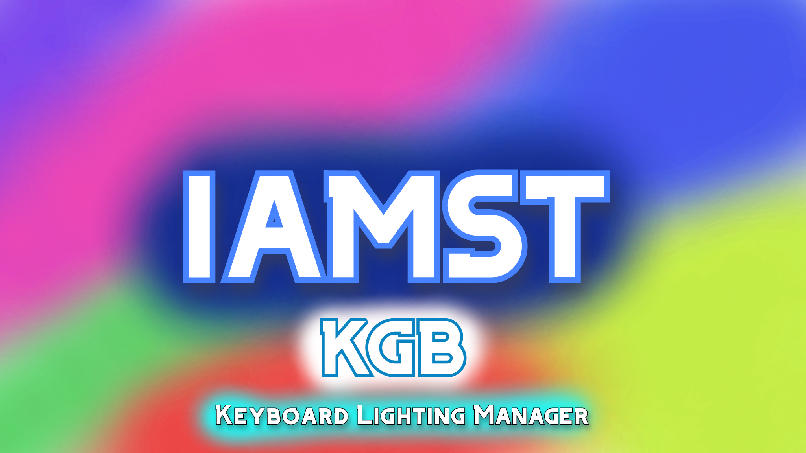

# Imst.KGB, Easy RGB Toggle
### Toggle the RGB lighting, on an RGB keyboard, on Linux with ease.

Iamst.KGB is an app to turn on and off the RGB lighting, on an RGB keyboard on Linux. (Right now it only works on Linux, because that’s where it is needed.)

Unfortunately, scroll lock doesn’t work on Linux. And as a result, RGB keyboards don’t light up on Linux operating systems, because their light is toggled by the scroll lock key.

People have to either physically add the scroll lock key or run commands every single time they run their computer.

Well, fear not citizens, This app can toggle the RGB lighting on your keyboard.

The goal of this app is to be minimalistic and simple, so it can be used like the tool it is. I stepped back from adding any useless, fancy feature that may make this app too much of trouble to work with.

Right now, you just run the app and the lights on your keyboard turn on. And you can toggle it with the help of light switches in the app.
